<div align="center">

# Rewind

Browse every site's design history as replayable snapshots

[![Live][badge-site]][url-site]
[![HTML5][badge-html]][url-html]
[![CSS3][badge-css]][url-css]
[![JavaScript][badge-js]][url-js]
[![Claude Code][badge-claude]][url-claude]
[![License][badge-license]](LICENSE)

[badge-site]:    https://img.shields.io/badge/live_site-0063e5?style=for-the-badge&logo=googlechrome&logoColor=white
[badge-html]:    https://img.shields.io/badge/HTML5-E34F26?style=for-the-badge&logo=html5&logoColor=white
[badge-css]:     https://img.shields.io/badge/CSS3-1572B6?style=for-the-badge&logo=css3&logoColor=white
[badge-js]:      https://img.shields.io/badge/JavaScript-F7DF1E?style=for-the-badge&logo=javascript&logoColor=black
[badge-claude]:  https://img.shields.io/badge/Claude_Code-CC785C?style=for-the-badge&logo=anthropic&logoColor=white
[badge-license]: https://img.shields.io/badge/license-MIT-404040?style=for-the-badge

[url-site]:   https://rewind.neorgon.com/
[url-html]:   #
[url-css]:    #
[url-js]:     #
[url-claude]: https://claude.ai/code

</div>

---

## Overview

Rewind keeps the design history of the Neorgon fleet browsable. Snapshots come from each
project's git history or from the live domain, and every one loads as a real, clickable
page rather than a picture of one. Scrub a site's filmstrip, compare two eras side by
side, or capture today's design before the next redesign erases it.

**Live:** rewind.neorgon.com

---

## Features

- **Replayable snapshots** -- every capture opens as a working page in the stage, scripts and all
- **Git time machine** -- `capture.py git` extracts full working trees from a project's commit history, one per design-changing day
- **Live mirroring** -- `capture.py live` downloads a page plus its same-host and CDN assets into a durable local tree
- **In-browser capture** -- grab any CORS-friendly page from the site itself; it inlines into one file kept in IndexedDB
- **Screenshot filmstrip** -- headless Chrome renders each snapshot into a JPEG card; arrow keys scrub through time
- **Compare mode** -- two snapshots side by side with independent pickers, for before/after archaeology
- **Device widths** -- desktop, tablet, and mobile stage presets, scaled to fit
- **Export and adopt** -- browser captures export as standalone `.html`; `capture.py adopt` promotes one into the committed archive

---

## Running locally

ES modules require an HTTP server (not `file://`):

```bash
make serve          # http://localhost:8862
```

Build or extend the archive with the capture CLI (Python 3 stdlib, no installs):

```bash
python3 tools/capture.py git neorgon-site --shots    # backfill from git history
python3 tools/capture.py live neorgon.com --shots    # mirror the live page
python3 tools/capture.py shot --missing              # screenshot anything new
python3 tools/capture.py fleet --shots               # baseline every live site
python3 tools/capture.py list                        # inspect the manifest
```

Screenshots need Chrome or any Chromium (`CHROME_BIN` overrides autodetection).

---

## Architecture



```
rewind-site/
├── index.html                  # Shell: header/footer kits, capture + help modals
├── css/
│   └── style.css               # Accent + rail, filmstrip, stage, compare styles
├── js/
│   ├── app.js                  # Entry point: load manifest + IndexedDB, render, bind
│   ├── state.js                # Selection, width preset, prefs, timeline merging
│   ├── data.js                 # manifest.json fetch + IndexedDB for browser captures
│   ├── capture.js              # In-browser capture engine (inlines CSS, images, scripts)
│   ├── render.js               # Rail, filmstrip, stage, compare, iframe scaling
│   └── events.js               # Clicks, keyboard scrubbing, capture and import flows
├── tools/
│   └── capture.py              # Archive builder: git / live / shot / adopt / fleet / list / rm
├── data/
│   └── manifest.json           # Snapshot index the viewer renders (generated)
├── snapshots/<site>/<stamp>/   # Captured page trees (generated, committed)
└── shots/<site>/<stamp>.jpg    # Filmstrip screenshots (generated, committed)
```

The archive is data, not code: `tools/capture.py` writes trees under `snapshots/`,
screenshots under `shots/`, and the index in `data/manifest.json`; the viewer only reads.
Git-sourced trees are pruned of heavy media (`assets/previews`) and identical files
across snapshots deduplicate inside git's object store, so twenty eras of a site cost
far less than twenty full clones.

---

<div align="center">
<sub>Part of <a href="https://neorgon.com/">Neorgon</a></sub>
</div>
