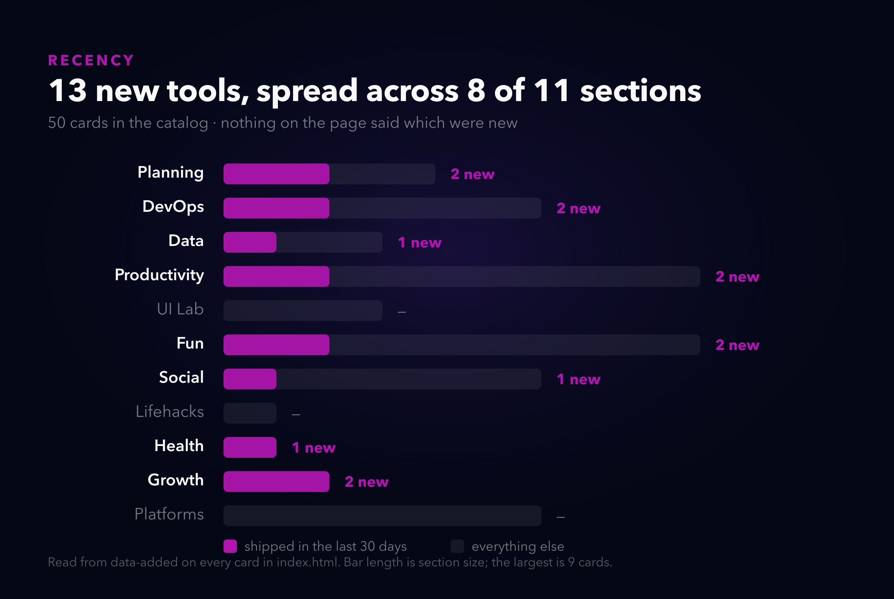
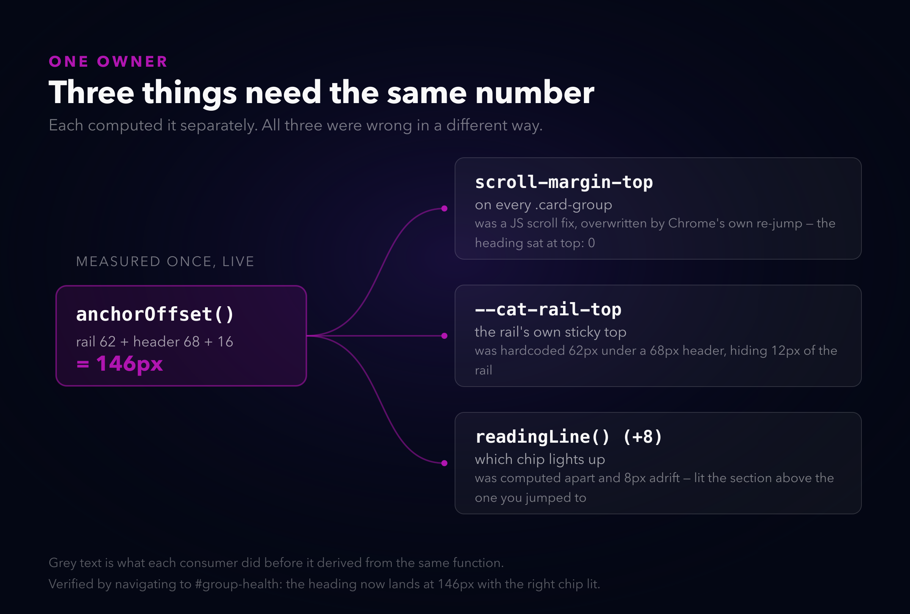
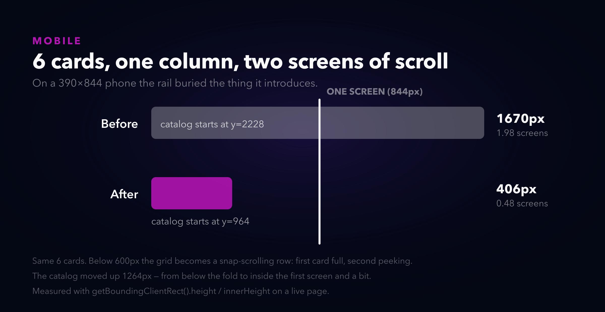
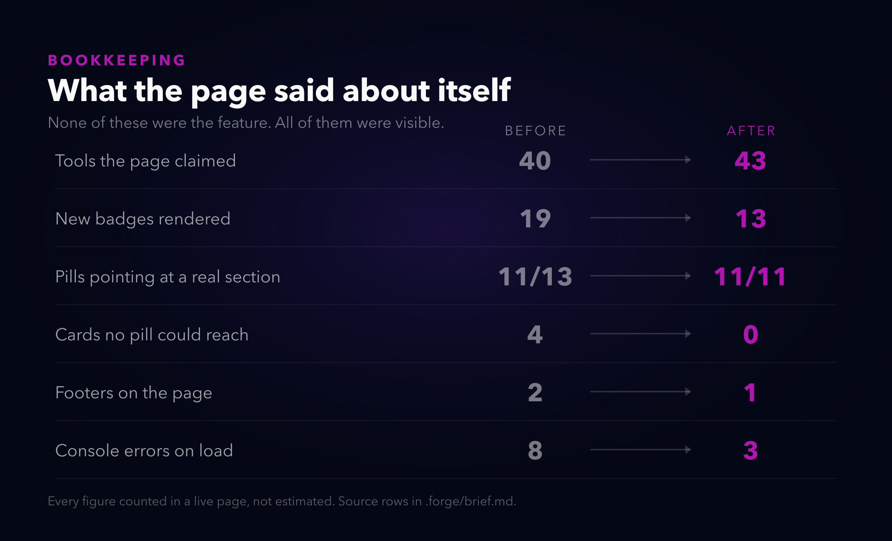

# My hub had 50 tools and no way to find any of them

*Alternate titles: "The homepage that couldn't count" · "13 new tools nobody could see" · "One number, three owners"*

---

I build a lot of small tools. Fifty of them, as it turns out, all listed on one page at neorgon.com, sorted into eleven categories, and I hadn't really *looked* at that page in months. I'd been adding cards to it the way you add things to a drawer.

So I sat down to fix one specific thing that bugged me: I ship something new and there is no way to tell. It goes into whatever category it belongs to, in whatever order, and it looks exactly like the tool I made in February. If you'd visited before, you had no way to know what changed. You'd have to scroll eleven sections looking for a name you didn't recognise.

That was the ask. What I actually found was that the page was wrong about itself in about six different ways, and none of them were subtle. They were just never measured.

## The thing I came to fix

The first job was giving the page a concept of time, because it had none. Nowhere in that HTML did it say when anything shipped.

I put a `data-added="YYYY-MM-DD"` on every card. Fifty dates, mostly pulled from git history. The date lives on the thing it describes, which means adding a tool never involves updating a list somewhere else.

Then a shelf above the categories reads those dates, shows the newest six, and stamps a `New` badge on anything under thirty days old. The badge expires on its own. That was the whole point.

Thirteen tools in the last thirty days, scattered across eight of the eleven sections. That's the chart that convinced me this was worth doing. Thirteen things I'd shipped, and the page had no opinion about any of them.

I considered two other ways to get those dates and rejected both. Reading them from the monorepo's site registry was the obvious one — it's the actual source of truth for the fleet, it already lists every site. But it has no launch-date field, so I'd be adding one anyway, and then the homepage needs a runtime `fetch` and a CSP entry to read static data that never changes. Worse, the shelf would silently empty out whenever that fetch failed.

The other option was a hand-curated array of recent IDs, which is genuinely the simplest thing that works. It loses because nothing expires. That badge sits on a four-month-old tool until I remember to rotate the list, and I will not remember to rotate the list.

## The part I didn't come to fix

Eleven categories, fifty cards, and zero navigation. I hadn't noticed because I know where everything is. I built it.

So: a sticky rail of category chips under the header, with live counts, that highlights whichever section you're currently looking at. Boring. Exactly the kind of thing that should have been there from the start.

And then I spent most of the afternoon on it, because of one number.

Three separate things need to know how tall the sticky chrome is. Where a chip-click parks a heading. Where the rail itself sits. And which chip lights up as you scroll. Each of them worked it out independently, and each was wrong differently.

The rail had a hardcoded `top: 62px` under a header that is 68px tall, so 12px of it lived under the header forever. The scroll-spy's reading line was computed apart from the jump target and ended up 8px below it — which sounds like nothing, and meant that jumping to Health highlighted Lifehacks, because the section you just landed on counted as "not reached yet". Eight pixels.

The deep-link one is the one I'll remember. Load `neorgon.com/#group-health` and the heading landed at `top: 0`, underneath 130px of sticky header and rail. Fine, I thought, scroll it down in JS after the jump. Didn't work. Re-fired it on a timer at 120ms, 400ms, 900ms. Didn't work. Re-fired it on `load`. Didn't work.

I sampled the scroll position sixteen times over a second and a half, and the group's top edge was `0` in every single sample. Not drifting — pinned. Chrome re-applies the fragment scroll every time the layout shifts while the page is still loading, and images were still arriving, so every correction I made got overwritten by the browser doing its jump again.

`scroll-margin-top` is the only offset the browser's own jump respects. Declare it and every re-application already lands in the right place. So the fix was to delete the arithmetic, not to fix it.

All three now come out of one `anchorOffset()` function, and the terminal's `open <category>` command reads it too instead of keeping its own copy. Which is the actual lesson and it isn't about scrolling: three things computing the same number is three chances to be wrong, and they took all three.

## Six cards is a lot on a phone

I resized to 390px and the shelf was two full screens tall.

Six cards in one column, 1670px, and the catalog — the thing the shelf exists to introduce — started at y=2228. You had to scroll past two screens of "here's what's new" to reach anything.

Below 600px it's a swipe-able row now. First card full, second peeking so you can tell there's more. Same six cards, 406px, catalog at y=964.

The detail that cost me twenty minutes: scroll-snap aligns against `scroll-padding-inline`, not `padding-inline`. With the wrong one the first card snapped flush to the screen edge, sitting 18px out of line with its own heading. It looks like a rounding bug and it's a different property.

## And then the bookkeeping

This is the part I'd rather not publish, honestly. None of it was hard. All of it was visible for months on my own homepage.

The hero said "40 tools" in the HTML while a script computed 43 on load, so the number visibly flipped in front of you. The title, the meta description, the OG tags and the JSON-LD all said 40 too. There were 19 `New` badges for 13 new tools, because the shelf clones cards and the clones inherited a badge that was stamped before cloning. Two footers, stacked. And a `Learning` category pill that matched no section at all, plus a `Game` pill that filtered the catalog down to zero results — four tools were unreachable by pill entirely.

Also three broken CSP directives, one of which mattered: `script-src` and `connect-src` were missing the hosts the terminal's login needs, which means that path was dead in production and had been for a while. Nobody reported it. It's a hidden terminal on a personal site. But it was broken, and I only found it because I was testing something adjacent.

Console errors on load went from 8 to 3. The remaining three are a `frame-ancestors` warning that Chrome ignores in a `<meta>` tag by design, and two from a sibling site not running on my laptop. Those are fine.

## The terminal

There's a hidden terminal on the site. It had a hardcoded list of tools in it, which was already out of date, because of course it was.

It reads the DOM now — same cards, same categories — so a new tool is reachable by every command with no terminal edit. Twelve commands: `tools`, `goto`, `open`, `search`, `new`, `whois`, `stats`, `random`, `categories`, `theme`, `fortune`, plus Tab completion.

I'd originally wanted `theme` to change the fleet-wide header default through the CDN, and I talked myself out of it while writing it. A page anyone can open should not be able to restyle every site I run. It sets the visitor's own cookie and nothing else. Changing the fleet default belongs in an ops console behind a login, which is a different afternoon.

## Where this is still broken

Two cards on the hub are dead links as I write this, and both are infrastructure rather than anything in this repo. `pieza.neorgon.com` has no DNS record at all — I shipped the card before the subdomain existed, which is a nice illustration of the problem this whole post is about. `cardforge.neorgon.com` answers over HTTP but not HTTPS because GitHub Pages hasn't provisioned its certificate, and the API returns 422 or 404 for every attempt to force it, so it gets waited out.

The registry disagrees with reality on five more sites — two are live with no card, three are marked as having a card while returning nothing. I left that alone deliberately. Reconciling it means deciding, per site, which side is wrong, and guessing would be worse than leaving the disagreement visible.

Two of my fifty ship dates are proxies and marked as such in the HTML. One repo's history starts at a bootstrap commit; another's remote points at an entirely unrelated project. They're close enough to order the shelf correctly and they are not ship dates.

And the footer is still the old hand-rolled one rather than the shared kit every other site uses. That's a fleet-wide migration with its own runbook, not something to smuggle into a homepage change.

## What I'd actually take from this

The recency shelf was the feature I set out to build and it's the least interesting thing here.

The interesting one is that every real defect on that page was countable. Not "the navigation feels bad" — 4 cards unreachable, 2 footers, 19 badges for 13 tools, 12px of overlap, 8px of drift. I'd looked at that homepage hundreds of times and read past all of it, because reading a page is not the same as measuring it. I found every one of these by asking the browser a question with a number for an answer.

The other one is smaller and I keep relearning it: when three things need the same value, give them one place to get it. The 12px and the 8px and the deep link that wouldn't stay put were all the same bug wearing three costumes.

---

*It's live at [neorgon.com](https://neorgon.com/) if you want to poke at it. The terminal is worth finding.*
