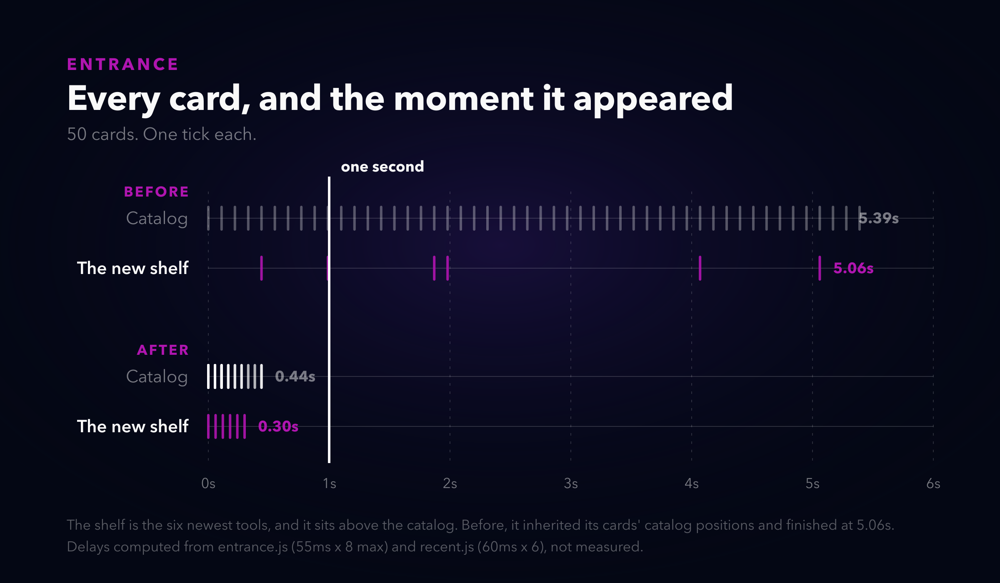
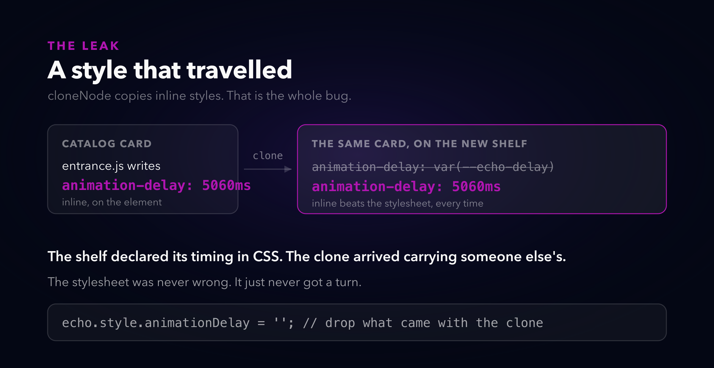
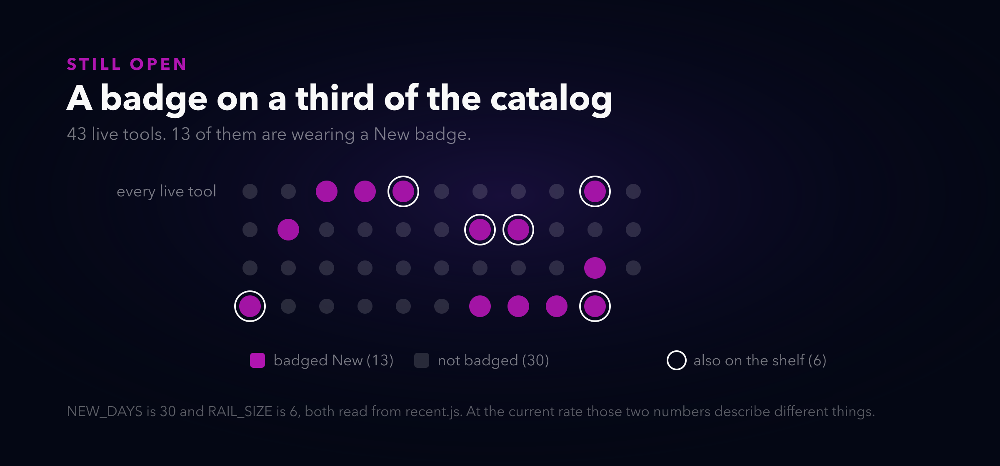

# A card that cannot lie

*Alternate titles: "My homepage kept its promises in CSS" · "The shelf that arrived last" · "Three things I stopped styling around"*

---

A while back I wrote about fixing the homepage that lists all my tools. It couldn't count, it had no sense of what was new, and eleven categories of cards had no navigation at all. I fixed those and felt good about it.

Then I opened it again and clicked a card, and nothing was there.

The tool was real. I'd built it. The card was on the page with its icon and its description and its little arrow, and the domain on the front of it did not answer. I had reserved the subdomain, put the card up, and never published the site. The page had been telling visitors to go somewhere that didn't exist for three days and I only found out because I clicked it myself.

That is the whole post, really. Not the bug. The shape of it.

## Three complaints, one shape

Three things were wrong at once, and I want to put them next to each other because they look unrelated until they don't.

**One.** A section of the page listed other people's websites. Good websites, curated ones, pulled live from an API I wrote. But the page's job is to answer "what did these people build", and a block of external links in the middle of that answer makes the whole page vaguer. You can no longer tell by looking which things are ours.

**Two.** A card pointed at a domain that serves nothing.

**Three.** The shelf at the top labelled *Recently shipped* was the last thing on the page to appear. Not last by a little.



Fifty cards. Every tick is one of them arriving. The six that make up the new-tools shelf are the pink row, and before the fix the last of them landed at 5.06 seconds. Five seconds is not a slow animation, it's a different page. Anyone who scrolled in the first two seconds saw a heading with nothing under it.

Here's what those three have in common: in each case the page made a claim, and the claim was maintained somewhere other than the thing making it. "These are our tools" was maintained by me remembering not to add other people's. "This card goes somewhere" was maintained by me remembering to publish before adding the card. "This shelf is the newest stuff, look at it first" was maintained by a CSS rule that turned out to have no authority.

## The shelf had no authority

That third one is the prettiest failure so I'll do it first.

The shelf is built by cloning cards out of the catalog below. Clone the card, retag it so the search index skips it, drop it in the shelf. The shelf sets its own stagger in CSS: first card at 0ms, then 60, 120, and so on.

Except the catalog's entrance animation writes its delay as an **inline style**, straight onto each element. And `cloneNode` copies inline styles.



So Proctor, the newest tool on the site and the 47th card down the catalog, carried `animation-delay: 5060ms` on its own `style` attribute, got cloned, and arrived at the top of the shelf still wearing it. The shelf's CSS said 0ms. Inline wins. It wasn't close and it was never going to be close.

I want to be clear that nothing here was subtle or clever. It's the first thing you learn about CSS. The reason it survived for months is that both halves are correct on their own: the catalog's stagger is fine, the shelf's stagger is fine, and the bug only exists in the sentence "and then we copy one into the other."

The fix is one line, in the copying:

```js
echo.style.animationDelay = '';
```

Drop whatever came with the clone. The shelf gets to own its own timing again, which is what the CSS was already saying.

I also capped the catalog's stagger while I was in there, because the old rule was `index * 110ms` across every card, which means the animation got slower every time I shipped a tool. Fifty cards was 5.39 seconds. A hundred would have been eleven. Now it staggers within each section and stops at eight steps, so the whole reveal costs 0.44 seconds no matter how big the catalog gets. That number is a constant now instead of a function of my output.

## The card that cannot be clicked

The dead link is the one I actually think about.

The obvious fix is to delete the card until the site is up. That works and I hated it, because then the hub can't show you anything that isn't finished, and I wanted somewhere to put work in progress. The second obvious fix is to grey the card out and add a "Soon" badge. That's what I meant to do when I sat down.

What I built instead is a card that is not a link. Not a link styled to look inert. Structurally not a link:

```html
<div class="site-card soon-card" data-card-id="pieza" data-status="soon">
  ...
  <span class="soon-badge">Soon</span>
</div>
```

A `<div>` has no `href`. There is no URL on it to click, to middle-click, to copy, to tab to, or to hand a crawler. The badge and the dim tell a person what's going on, and the element type makes it true whether or not anyone reads the badge.

The difference matters because I know exactly how the styled version fails. `pointer-events: none` stops the mouse and not the keyboard. `aria-disabled` is a label, not a behaviour. A grey `<a href="https://pieza.neorgon.com/">` is still a real URL in the markup, and something will follow it eventually. Every version of that fix is a promise I have to keep by hand somewhere else, which is the thing that put me here in the first place.

The same attribute then does the rest of the work. `data-status="soon"` is read by the hero count, the search count, the recently-shipped shelf, the command palette and the terminal. The headline used to say "we made 46 tools" while three of them served nothing; it says 43 now, and it says it because the selector excludes them, not because I typed 43. Search still finds a Soon card, and the counter reads `5 of 43 tools · 1 coming soon` rather than pretending. Hit Enter on one in the command palette and it scrolls you to the card instead of navigating, because there is nowhere to navigate to.

One attribute, and every part of the page that could have lied about it now can't.

And the external section came out. That one needed no cleverness, just a decision: every card on the page points at something we own. The GitHub and YouTube cards stay under that rule, because those are our accounts. The curated-links feed doesn't, so it's gone. The site it fed is still there and still has its own card, which is fine, because that site is ours too.

## Where this is still wrong

I found more than I fixed. In fairness to the page, most of it only became visible because I was finally counting things.



The `New` badge expires after thirty days, which was a sensible number when I shipped two tools a month. I shipped thirteen last month. Thirteen badges on forty-three tools is not a signal, it's a texture. The shelf holds six and says "latest 6 of 13 new this month", which is honest and also an admission that the two numbers stopped agreeing. I think the badge should just mark whatever is on the shelf and nothing else, but I haven't done it.

Worse, and I only caught this while writing the diagrams: **three live sites have no card on the hub at all.** BattleCard, Failsafe and FitProfile are published, they're in the registry, they're in the machine-readable index the site publishes for crawlers, and they are not on the page that is supposed to list everything. The rule that says they must be there is written down in the repo. Nothing checks it. So the page I just spent a day making honest about three unpublished tools is still silently missing three published ones, which is funnier than I'd like.

That index file has drifted the other way too: four tools that are on the hub aren't in it. And the tool count is hardcoded as text in four places a crawler reads, which had already gone stale by three before I touched anything. My change happened to resync it, by luck.

All of which points at the same missing piece. There's a registry in this repo that already knows every site, its domain, and whether it's live. The hub is hand-written HTML. Two lists of the same fleet, maintained separately, and the only thing keeping them in agreement is me noticing. The fix isn't to generate the cards from the registry, because the card copy is real writing and doesn't belong in a data file. It's to have something fail loudly when they disagree.

Which, now that I write it down, is the same fix as the rest of this post.

---

The hub is at [neorgon.com](https://neorgon.com). Diagrams in this post are generated by a script that parses the page's own markup and reads the timing constants out of the modules, so if the numbers here are wrong, the build breaks rather than the picture quietly disagreeing with the site.
