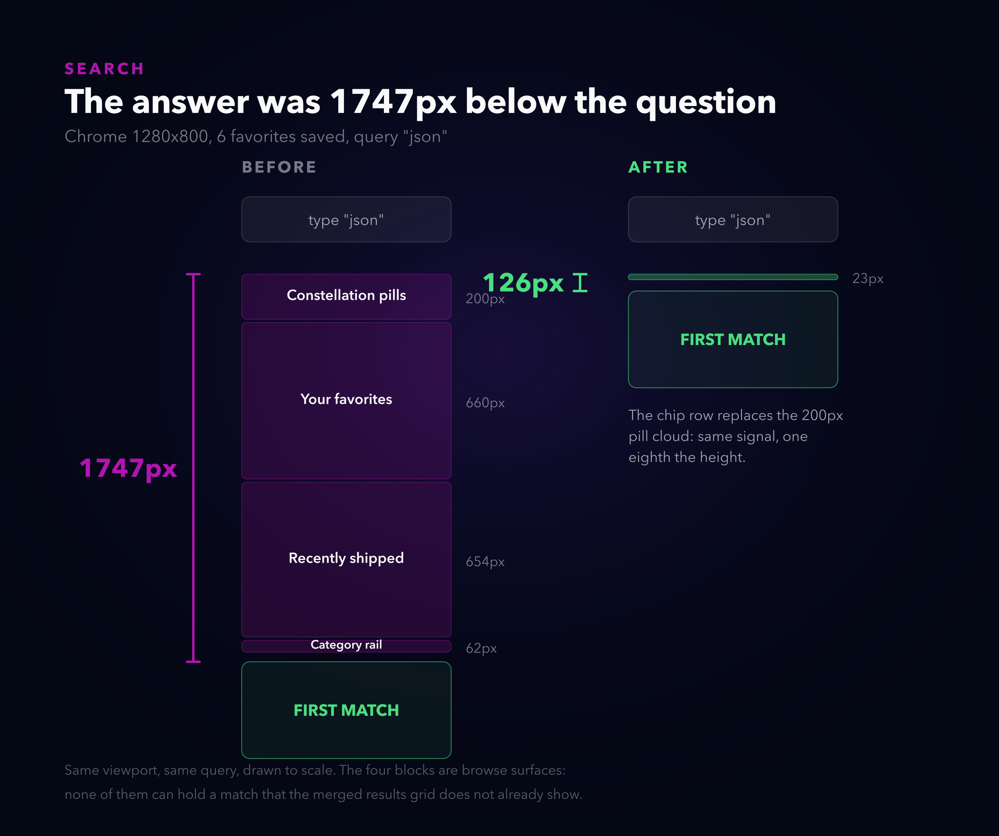
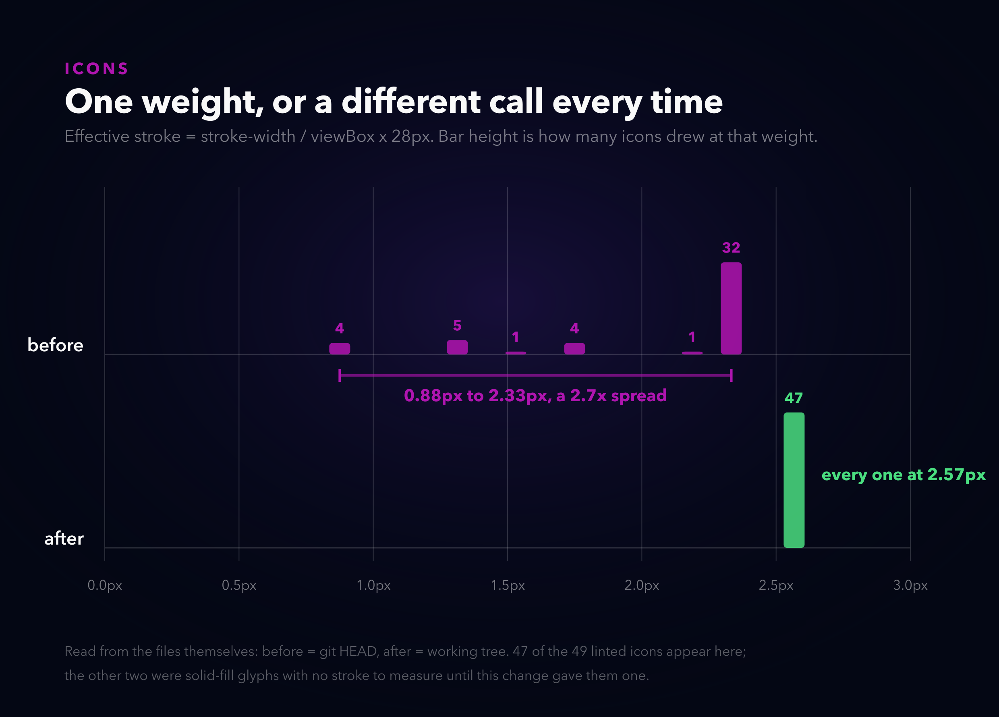
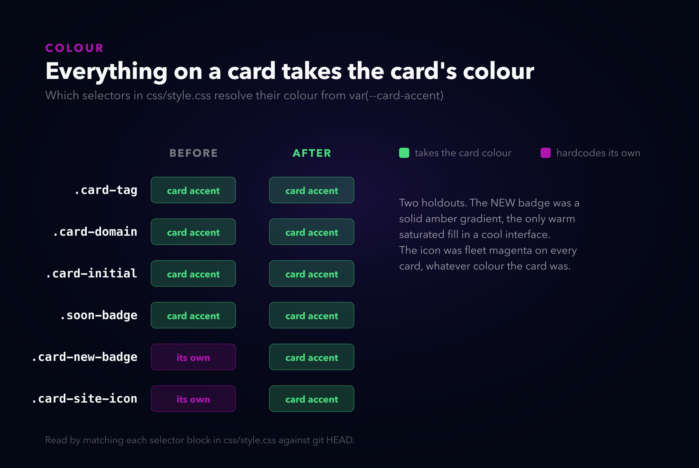

# Everything on the page was correct

*Alternate titles: "Three good decisions that added up to a bad one" · "The standard nobody could run" · "My homepage answered a question you couldn't see"*

---

I typed into the search box on my own homepage and nothing happened.

That is not what actually happened, but it is what it looked like, which turns out to be the same thing. The page filtered fine. The count updated fine. Seven tools matched and they were all there, sitting 1747 pixels below the box I had just typed into, past a shelf of my favorites, past a rail of recently shipped tools, past a sticky category bar that had already faded itself out but kept its 58 pixels anyway.



Drawn to scale. You type, and the page hands you the answer somewhere south of the fold.

Here is the thing that made me want to write this down. Every single one of those blocks is good. The favorites shelf was a good idea, I still think so. The recently shipped rail is the thing people actually click. The floating category pills are the most-complimented part of the whole site. Not one of them is a mistake.

They are just all in the way at the same time.

## Three good decisions

I want to put three complaints next to each other, because they look like three unrelated bits of polish and they are not.

**One.** Search results opened below everything I had ever added above them.

**Two.** The icons on the cards looked mushy, and some of them looked faint, and I could never tell you which ones or why.

**Three.** The NEW badge was a bright amber pill on a page that has no other bright amber anything.

The shape they share: each was a local decision that was right where it stood, made without looking at what it was standing in. Nothing here is a bug in the sense of code doing the wrong thing. The code does exactly what each of us asked it to, on the day we asked.

## The page was answering a question you couldn't see

The search fix is the easy one to describe and the one I should have done a year ago.

The realisation is that search is a **mode**, not a filter. When you type, you have stopped browsing. The favorites shelf, the recently shipped rail and the category rail all exist to help somebody who has not asked for anything specific yet. The moment you ask for something specific, all three are furniture.

So on `body.search-active` they leave the flow entirely, and the constellation collapses to nothing:

```css
body.search-active #favShelf,
body.search-active #recentRail,
body.search-active .cat-rail {
  display: none !important;
}
```

The part I had to check before I believed it: does hiding those lose you any result? No, and the reason is structural. Both shelves render `.site-card--echo` clones of catalog cards. Every card they could possibly show is already in the merged results grid one section down. Filtering them in place, which was my first instinct, would have shown you each match twice and cost the same vertical space, which is the actual complaint.

1747 pixels to 126. On a phone the first match lands inside the fold, so it is on screen before you lift your thumb.

The one thing the collapsing pill cloud did take with it was a real signal: "your query hit the DevOps group". So that got promoted out of the cloud and into a row of chips next to the result count. Twenty-four pixels instead of two hundred, and it says the same thing.

### Same trap, second occupant

One more from the same section, found much later and by accident. I typed `github` into the
search box and got three cards on screen, sitting underneath the words **"No tools match your
search."**

The count line says "N of 43 tools", and 43 deliberately excludes the four cards that point at
GitHub, GitLab, Docker Hub and YouTube, because those are not tools I made and padding my own
number with other people's websites would be a lie. Fine. The problem is that the *empty state*
was reading the same number. Match only external destinations and the page counts zero tools,
concludes nothing matched, and says so on top of the three things it is currently displaying.

What makes this one worth writing down is that the fix was already in the file. Right above,
with a comment:

> Soon cards are searchable but uncountable, which would otherwise let a query match a card on
> screen and still report zero. Counted separately so the line describes what is actually
> visible without inflating M.

Past me hit this exact trap, understood it precisely enough to write that sentence, fixed it,
and fixed it *for Soon cards*. The external cards are uncountable for a different reason and
were sitting in the same hole the whole time. It now reads "1 external", or "1 of 43 tools ·
1 external" when a query hits both.

### The bug I only found because my browser was broken

I built the chip row by reading the `matched` flag off the pill objects, since the pills already compute exactly this. Clean, no duplicate logic. Then I tested it in a preview pane that throttles `requestAnimationFrame`, the pills never initialised, and the chip row silently rendered empty.

My first thought was that the test environment was wrong, which it was. My second thought, a beat later, was that the chip row is **information** and the pill cloud is **decoration**, and I had just made the information depend on whether the decoration booted. A background tab would have done the same thing. So the chips now derive from the category list and the query directly, and they do not care whether anything is floating.

I also found, while I was in there, that my scroll-into-view helper had this guard:

```js
if (target <= window.scrollY + 4) return;
```

which means it only ever scrolled **down**. Search from halfway into the catalog and it did nothing at all, in exactly the situation where you most needed it to move.

## The standard existed. Nobody could run it.

Now the icons, which is the part I got wrong for longer and more embarrassingly.

The complaint was "the glow is bothersome, they should be bolder and sharper". The glow was easy, it was one line:

```css
filter: drop-shadow(0 0 3px rgba(227, 38, 228, .7));
```

A three pixel blur radius, on a stroke about two and a bit pixels wide. Every path in every icon had a magenta halo roughly as wide as itself, on both sides. The artwork was competing with its own glow. That is the entire reason nothing looked sharp, and it took me about four minutes to find and ten seconds to fix.

"Bolder" was the interesting half. Because these icons render through `` at a fixed 28 by 28, the `stroke-width` written in the file means nothing on its own. What your eye gets is:

```
effective stroke = stroke-width / viewBox-size x 28
```

Which is how I ended up with this:



Thirty-two icons at 2.33 pixels, and a long faint tail of icons drawn on a 64 unit canvas landing anywhere from 0.88 pixels up. A 2.7x spread. The faint ones were not faint because anyone chose that. They were faint because somebody, usually me, drew a more detailed icon on a bigger canvas and kept `stroke-width="2"` because that is what the small ones said.

Then I opened `docs/ICONS.md`, which I wrote, and found this already in it:

> **Viewbox:** `0 0 24 24` (standard)
> **Stroke weight:** `2` (consistent across all icons)
> **Fill:** `none`
> Ensure the SVG has no fixed `width`/`height` attributes

Every rule I needed was already written down. All forty-nine card icons violated at least one of them. Fourteen were on a 64 unit canvas. Three had `stroke="currentColor"`, which is correct for an inlined SVG and completely wrong inside an ``, where there is no host page colour to inherit and it resolves to **black**. Those three had been rendering as near-invisible smudges on a dark card and I had walked past them for months. Several still carried `width="800px"` from whichever icon site they were downloaded from.

A rule you cannot execute is a rule that decays quietly. So the doc now has a linter next to it:

```bash
python3 scripts/icon-lint.py --fix
```

It computes the target weight from each file's own viewBox, rewrites `currentColor`, strips the leftover dimensions, and exits non-zero when anything is off. It scopes itself to `.card-site-icon` specifically, which matters more than it sounds: an earlier version linted every `assets/icons/` reference in the page and cheerfully offered to recolour the white warning glyph on the secret trigger magenta. Consistency applied to the wrong set of things is just a different kind of wrong.

Forty-nine icons, one weight, 2.567 pixels each.

And then, having made every icon agree with every other icon, I noticed they still did not agree with the card they were sitting on.

### Seventeen of them had to be redrawn

You cannot just thicken a detailed icon. Rigcheck's camera, Proctor's clipboard, Pieza's dice: crank the stroke to match and the small gaps close up and you get a blob. So seventeen got redrawn on the 24 unit grid, simpler, fewer shapes, built to carry the heavier line.

Three of them I got wrong the first time, and I only know that because I rendered the whole set as a contact sheet instead of looking at files:

- **Doorman** was a doorman's cap above a door. A wide brim on a narrower rounded body is, unmistakably, a kitchen bin. I stared at it for a while insisting it was a door. It is a bin. It is an archway now.
- **Resume Forge** was a document above a controller bar. Same width, directly underneath, so it read as a laptop.
- **UI Anatomy** simplified down to "rectangle with some lines in it", which is precisely what Incident Runbook and Hiring Pack already looked like. A header bar and a sidebar split says wireframe and nothing else does.

Two more things fell out of looking at all of them together. `safeguard.svg` and `lockdown.svg` were **byte-identical files**. Two different security tools, same glyph, and nobody had noticed because you never see them side by side in the catalog. They do sit side by side in a contact sheet.

## Two things that ignored their own card

Every card on the hub sets a `--card-accent`. The tags use it. The domain line uses it. The Soon badge uses it. Two things did not.



The NEW badge was a solid amber gradient with dark text and a twelve pixel amber glow, the only warm fully-saturated fill in a cool navy interface. The fix was not to invent anything: `.soon-badge`, two hundred lines up the same stylesheet, already had the right pattern, accent-keyed and outlined with a small leading dot. The NEW badge adopts it and sits one step louder. Now it is green on a Planning card, blue on CardForge, rose on SafeGuard.

The icon was the other one, and it is the more interesting of the two, because an `` genuinely cannot do this. It loads as its own document with no access to the page's colour, which is the same reason `currentColor` was rendering three icons black. So the icon stopped being an image and became a **shape**:

```html
<span class="card-site-icon" aria-hidden="true"
      style="--icon: url('/assets/icons/pathfinder.svg')"></span>
```

```css
span.card-site-icon {
  background-color: var(--card-accent, #E326E4);
  mask-image: var(--icon);
}
```

The file supplies the outline, the card supplies the colour. That also gets you the rest of "bolder" for free: a saturated shape filled with the card's own colour reads heavier than a thin magenta line on a tinted tile, without touching the stroke weight again.

Two things bit me. The first cost a debugging round and I am still slightly annoyed about it: a relative `url()` inside a custom property resolves against the stylesheet that **substitutes** the variable, not the file that declared it. My paths were written in `index.html` and consumed in `css/style.css`, so `assets/icons/x.svg` quietly became `/css/assets/icons/x.svg`, and all forty-nine masks 404'd. A masked element with a missing mask is not a broken image icon. It is nothing at all. The page just looked like it had no icons.

The second was better news. Once the icon was a `<span>` I had to decide what it announces, and the honest answer is nothing: it repeats the card's own name, so a screen reader was reading "Pathfinder, pathfinder.neorgon.com, Pathfinder". It is `aria-hidden` now. The old `` had exactly the same problem and I had never once thought about it.

I had written the right pattern already, twice. I just wrote the badge and the icon on different days.

## The counter-argument

The obvious objection to the search change: you have hidden my favorites. I saved those.

Fair, and it is why I checked the clone thing carefully rather than assuming. But the honest answer is that a search is a question with an answer, and everything between the question and the answer is a tax. Your favorites come back the instant you clear the box, and the page even returns you to the scroll position you were reading at before you typed.

The objection to the icon weight: 2.2 on a 24 grid is not Lucide's stock 2, so I am off-standard from the library the set came from. True. It is a deliberate deviation, it is 2.567 effective pixels against 2.33, and it is now written into `docs/ICONS.md` with the reason. If I had left that undocumented, the next person to add an icon would paste in a stock Lucide file at weight 2 and the drift would start again the same afternoon.

The objection to masking: every icon is now one flat colour, so the set is less characterful than fifty individually-considered magenta drawings. Also true, and I put both versions side by side before deciding, because I did not trust myself to judge it from a description. The magenta version has more pop per icon. The accent version looks like somebody designed the card. I went with the card.

## Where it still breaks

- **The four brand marks do not follow the rule.** GitHub, GitLab, Docker and YouTube keep their
  own artwork and their own colours, so the one sentence this whole post is about, everything on a
  card takes the card's colour, has four exceptions sitting right there in the catalog. Recolouring
  someone else's trademark to match my card would be worse, so they stay wrong on purpose. They at
  least announce themselves: those cards already had a dashed border and an EXTERNAL badge, so the
  odd icon reads as deliberate rather than as a bug. The linter now enforces the exception in both
  directions, so nobody can tidy a trademark into the accent colour later.
- **`make hooks` is opt-in, per clone.** The check runs before every commit that touches an icon,
  but only once you have run that command in your own working copy. Git config is not committed
  state. A fresh clone is back to remembering.
- **The numbers in this post are copied, not computed.** The diagrams read the icon files and the
  stylesheet directly, so those cannot drift. The layout measurements cannot: no function in the
  repo returns "how far below the search box the first result is", so they come from a browser
  and land in the generator by hand. That is exactly the shape of problem the rest of this post is
  about, still sitting there, one level up.

A short honest note, since it is the point of the whole exercise: while writing this I changed
the icon markup and both scripts silently stopped seeing it. The linter cheerfully
reported "all 0 linted icons on standard" and exited zero, which is the single most dangerous thing
a checker can do. Both now refuse to pass when they match suspiciously few icons, and I made the
regression happen again on purpose to watch them fail. A check you have never seen fail is not a
check, it is a decoration that agrees with you.

---

*Everything here is on [neorgon.com](https://neorgon.com). Type something into the search box. The cards show up now.*
