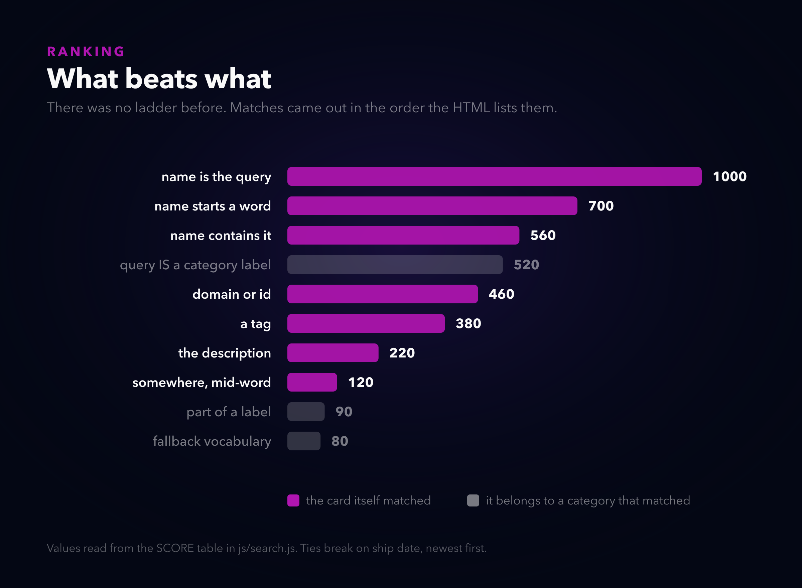
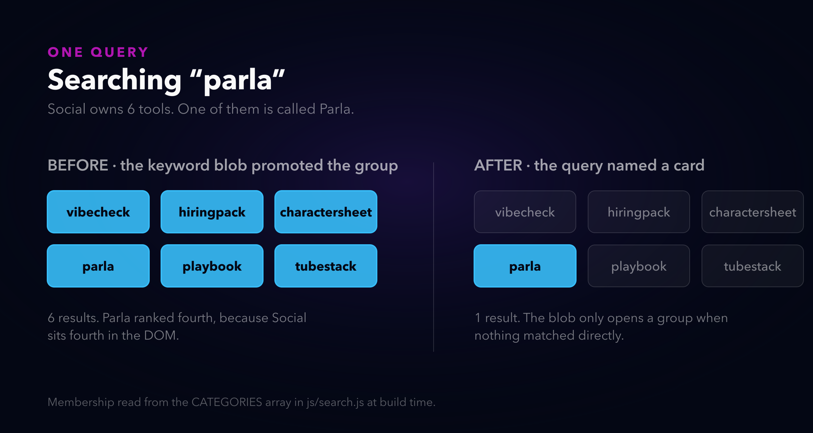
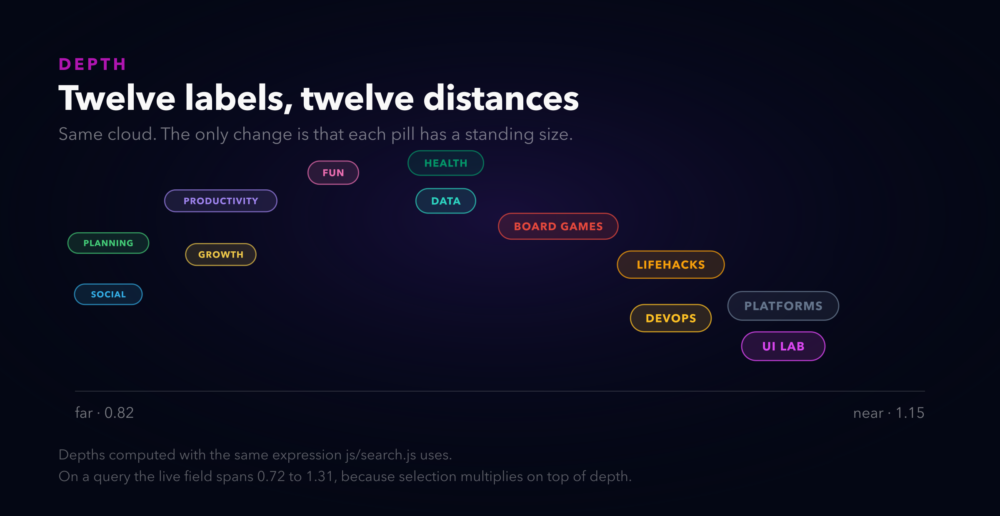

# I deleted the thing I wrote a blog post defending

*Alternate titles: "The navigation left when you started navigating" · "Twelve labels at exactly one distance" · "My homepage answered with a category"*

---

Four months ago I wrote a post on this site arguing that search is a mode, not a filter. When you type, you have stopped browsing, so the favorites shelf and the recency rail and the category bar are all furniture, and they should get out of the way. I was pleased with that one. It had a diagram drawn to scale showing 1747 pixels of stuff between the box you typed into and the answer, and it ended with the number going to 126.

Part of what I did to get there was collapse the floating category pills to nothing on the first keystroke.

I have just undone that. This is the post about why, plus three other things that turned out to be wrong at the same time, which is what happens when you finally look at a page you have been shipping to for a year.

## The complaint that started it

> The search matches are bad. Searching for parla returns 6 results, and in fourth place, Parla.

Parla is a Latin American slang translator. It is one tool. Typing its name returned six things with it somewhere in the middle, which is the kind of bug that makes you distrust a search box permanently, because you cannot tell whether it is bad at finding or bad at ordering.

It was both. That is the actual finding here and it took me a while to accept it, because each half looks like it would explain the whole thing on its own.

### Half one: there was no ranking

Not a bad ranking. None.

The filter collected a set of matching card IDs, and then a function walked the catalog in DOM order and appended anything in that set. Parla was fourth because the Social section is the fourth thing in `index.html`. If I had moved that section up, the "bug" would have looked fixed.



Every match now carries a score, and the merged grid is filled in score order. Ties break on ship date, newest first, which is what the command palette was already doing, so at least the two agree now.

The numbers themselves are not interesting. What is interesting is the gap between 560 and 90: a card whose *name* contains your query beats a card that merely *belongs to a category* your query mentioned, by a margin nothing else can close.

### Half two: the keyword blob was an amplifier

Each pill carries a long string of synonyms so that searching "cheatsheet" can find the DevOps tools even though no card contains that word. Good idea. The implementation was: if the query appears anywhere in the blob, every card in that category is a match.

The word "parla" is inside Social's blob, because I put it there so people could find Parla.



So the blob got demoted. It is a fallback vocabulary now, not an amplifier: it only opens a group when the query matched no card directly. "cheatsheet" names nothing, so it is allowed to mean DevOps. "parla" names a card, so it is not allowed to mean all of Social.

A category's own *label* still expands unconditionally, because clicking the Social pill sets the query to "Social" and showing you the whole group is the entire point of clicking it. That exception is the one thing here I would call load-bearing. Take it out and the pills stop working as navigation, which brings me to the part I got wrong.

## The navigation left when you started navigating

Here is the thing I did not see four months ago, and honestly should have.

The pill cloud is not decoration that happens to filter. It is the navigation. It is the only surface on the page where you can see all twelve categories at once and pick one without knowing its name in advance. And I had it collapse to `height: 0` on the first keystroke, which is precisely the moment somebody is trying to steer.

The fold arithmetic that justified it was correct. Two hundred pixels is two hundred pixels. What was wrong was treating it as the only place I could get them from, when directly below there was a "Recently shipped" shelf laying out six cards in three columns, wrapping to two rows, costing 609 pixels to say "here are six new things".

That shelf is one row now. It scrolls sideways, four fit, the fifth peeks. 609 pixels to 379, and the category bar moved up 165. So the cloud got its two hundred back from somewhere that was not paying for them.

## Twelve labels at exactly one distance

While the pills were on screen during a search for the first time, the other problem became obvious: they were flat.

Twelve pills, same size, same weight, drifting on the same plane. That is not a constellation, it is a list that happens to be arranged in 2D. The site's whole look is space, and the one element that should have sold it was the one element with no depth in it at all.



Every pill now has a standing depth between 0.82 and 1.20, derived from its index rather than randomised, so a category keeps its distance across reloads and you can start to learn where things are. Near ones are bigger, brighter, sit on a softer halo, and their routes are drawn heavier. Far ones are small and thin, the way a far light is.

The part that actually sells it is the parallax. Drift is scaled by depth squared, so a near pill sweeps further across your view than a far one moving at the same speed. Without that, the sizes say "nearer" and the motion says "all at the same distance", and the motion wins every time. I had it wrong in the first pass and the field looked like a font-size mistake.

Then scale became a product of four things that used to have no way to coexist:

```js
p._breathPhase += 0.0055 + (i % 5) * 0.0009;
var breath = 1 + 0.045 * Math.sin(p._breathPhase);

var want = isFiltering ? (p.matched ? 1.26 : 0.74) : 1;
p._stateScale += (want - p._stateScale) * 0.075;

var s = p.depth * breath * p._stateScale * (p._zoomScale || 1);
```

Depth is where it stands. Breath is a slow in-and-out so nothing is ever perfectly still. State is selection, eased rather than snapped, because a pill that jumps to its selected size has *changed* and a pill that grows into it has *approached*. Zoom is the existing bell-curve pop from the click handler.

They multiply. Four separate springs all writing `transform` would fight each other; one product cannot. And a far pill that gets selected still reads as the far one having come forward, which is the specific thing I wanted and could not get any other way.

On a live query the field spans scale 0.72 to 1.31. Nearly two to one between the furthest thing that receded and the nearest thing that arrived.

### The web that was drawing nothing

The lines between pills were connecting any two categories whose keyword blobs happened to share a word, plus every neighbouring pair, plus a wrap from the last to the first. Forty-odd chords across twelve moving points.

It rendered as a hairball, but the real problem is that it was meaningless in principle. "Data and Fun both contain the word cards" is not a relationship a line between two labels can carry. Nobody was ever going to read it, so the ink bought nothing.

It is geometric now. Each pill links its two nearest neighbours, re-derived every forty frames as they drift, drawn as bowed curves rather than chords, with a signal that travels along the path and takes the colour of the pill it is heading toward. A star chart connects what is near, not what is thematically alike. That is not a compromise, it is the correct answer, and I only got there by giving up on making the semantic version legible.

## Where it breaks

**The results start two hundred pixels lower during a search.** That is the trade, stated plainly. I bought it back from the shelf, but if you have favorites saved you have two shelves, and the first match sits further down than it did last week. I think the navigation is worth it. Someone who searches by typing exact tool names and never looks at the cloud is straight-up worse off.

**I predicted the category bar would land at y=890 and it landed at y=1132.** I priced a shelf card at 200 pixels tall and it is 285, and I forgot the hero would grow when I added the scroll cue. The direction was right and the number was wrong, and I only know that because I measured afterwards instead of trusting the estimate I had made the decision on.

**The header now hides on the way down, and I fixed the wrong thing first.** The report was "it does not stay at the top". I read that as a broken sticky, went looking, and found a real defect: `body` had `overflow-x: hidden`, which makes it a scroll container, and a sticky child then sticks to a box that never scrolls. Genuine bug, worth the `clip` that replaced it. Also not what was being asked for. What was being asked for was for the bar to leave.

**The kit change is only on this site.** Auto-hide was welded to the header kit's `app` mode, so wanting the behaviour meant taking a slim 56px gradient bar with it. It is an opt-in attribute now, in the canonical kit, but I have only vendored it here. Every other site in the fleet is running the previous copy until I sync them.

**The pill cloud does not boot in a background tab.** It waits on `requestAnimationFrame` for the box to have real dimensions, and a hidden tab freezes rAF. That was already true. What is new is that it now matters more, because the cloud carries information during a search. So the chip row I built four months ago as its replacement did not get deleted after all. It is the fallback, rendered only when the cloud never came up, which is a better job than the one it had.

---

*Built on [neorgon.com](https://neorgon.com). All three diagrams are generated by [`post/build-visuals-planets.mjs`](https://github.com/energon-a-secas), which parses `js/search.js` for the category membership, the score table and the depth expression, so a diagram here cannot quietly disagree with the code it describes. The fold measurements are browser readings and are labelled as such in the generator.*
